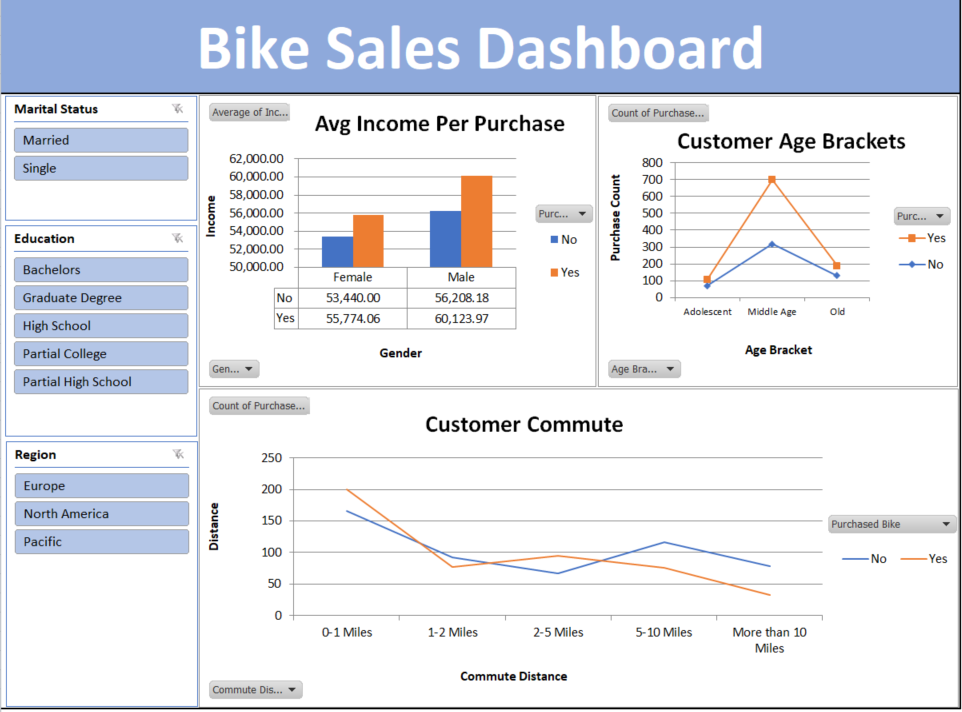

# 📊 Excel Customer Data Analysis Dashboard

An interactive **Customer Data Analysis Dashboard built with Microsoft Excel**, designed to clean, analyze, and visualize customer data through Pivot Tables, Pivot Charts, and interactive Slicers.

The project demonstrates practical skills in **data cleaning, data transformation, pivot table analysis, data visualization, and dashboard development using Excel**.

## 📊 Dashboard Preview



---

## 📌 Project Overview

The objective of this project was to transform raw customer data into a clear and interactive dashboard that provides useful insights into customer demographics, purchasing behavior, income, and commuting patterns.

The project follows a simple data analysis workflow:

**Raw Data → Data Cleaning → Data Transformation → Pivot Tables → Visualizations → Interactive Dashboard**

---

## 🧹 1. Data Cleaning & Preparation

Before creating the dashboard, the dataset was cleaned and prepared for analysis.

### Duplicate Records

* Identified and removed duplicate records using:
  **Data → Remove Duplicates**

### Data Standardization

Standardized inconsistent values in the dataset.

For example:

**Marital Status**

* `S` → `Single`
* `M` → `Married`

**Gender**

* `M` → `Male`
* `F` → `Female`

This ensured that the categories were consistent and easier to analyze.

### Age Group Categorization

A new **Age Group** column was created to categorize customers into different age brackets:

* **Adolescent**
* **Middle Age**
* **Old**

This additional field was created specifically to support demographic analysis and dashboard visualization.

---

## 📊 2. Pivot Tables & Data Analysis

Pivot Tables were created to summarize and analyze the cleaned dataset.

The analysis focused on several key areas:

### 💰 Average Income per Purchase

Analyzed the relationship between customer income and purchasing behavior to understand the average income associated with purchases.

### 🚗 Customer Commute

Analyzed customer commuting patterns to identify the distribution of different commute types.

### 👥 Customer Age Brackets

Analyzed the distribution of customers across different age groups.

Pivot Charts were then created from these summaries to make the results easier to interpret visually.

---

## 📈 3. Interactive Dashboard

The final dashboard combines the created charts into a single interactive view.

The dashboard provides a quick overview of the customer dataset and allows users to explore the data dynamically.

### Dashboard Visualizations

The dashboard includes visualizations covering:

* Average Income per Purchase
* Customer Commute
* Customer Age Brackets

### Interactive Slicers

Slicers were added to allow users to filter the dashboard based on:

* **Marital Status**
* **Education**
* **Region**

This allows users to explore specific customer segments and compare how different demographic groups behave.

---

## 🛠️ Tools & Excel Features Used

**Microsoft Excel**

Key features used in this project:

* Data Cleaning
* Remove Duplicates
* Data Standardization
* Data Transformation
* Calculated / Categorized Columns
* Pivot Tables
* Pivot Charts
* Slicers
* Dashboard Design
* Data Visualization

---

## 🔄 Project Workflow

```text
Raw Customer Data
        ↓
Data Cleaning
        ↓
Remove Duplicates
        ↓
Standardize Data
        ↓
Create Age Groups
        ↓
Create Pivot Tables
        ↓
Create Pivot Charts
        ↓
Add Interactive Slicers
        ↓
Build Dashboard
        ↓
Customer Insights
```

---

## 📁 Project Structure

```text
Excel-Customer-Data-Analysis/
│
├── 📊 Customer_Data_Analysis_Dashboard.xlsx
└── 📄 README.md
```

---

## 🎯 Key Skills Demonstrated

This project demonstrates practical experience in:

* **Data Cleaning & Preparation**
* **Data Transformation**
* **Data Analysis**
* **Pivot Table Development**
* **Pivot Chart Creation**
* **Interactive Dashboard Design**
* **Data Visualization**
* **Excel Reporting**
* **Filtering & Segmentation**
* **Turning raw data into actionable insights**

---

## 💡 Project Purpose

This project was created as a practical demonstration of how **Microsoft Excel can be used as a data analysis and business intelligence tool**.

The dashboard transforms a raw customer dataset into an interactive reporting solution that makes it easier to identify patterns, compare customer segments, and communicate insights visually.

---

## 🚀 Future Improvements

Potential improvements for future versions include:

* Adding KPI cards for key metrics
* Adding additional customer segmentation
* Creating more advanced calculated measures
* Adding trend analysis
* Improving dashboard interactivity
* Automating data refresh and cleaning
* Exploring the same dataset using **Power BI or Python**

---

## 👤 Author

**Islam Solaiman**

Data Analysis | Business Operations | Customer Experience

---

⭐ If you find this project useful, feel free to explore the workbook and the dashboard.
